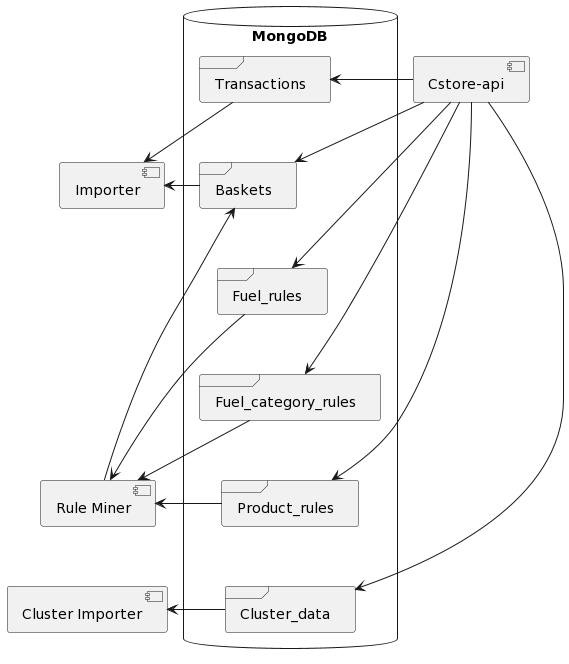

# Bachelor thesis project 2023

**Project in its current state isn't functional, as the data is owned by A2i Systems and not provided, and certain elements have been anonymized**

Stack:
* Python
    * mlxtend
    * pandas
* Java
    * Spring Boot
    * GraphQL
* Docker
* MongoDB

... And more 

This project contains the product of my thesis as part of my degree in Software Engineering. The project is structured around a service oriented architecture as seen below, where the left hand side is comprised of python services, repsonsible of instantiating mulitple collections in MongoDB. 

The cstore-api is responsible for providing the results of the importer, rule miner and cluster importer to 1 or multiple clients using GraphQL.

